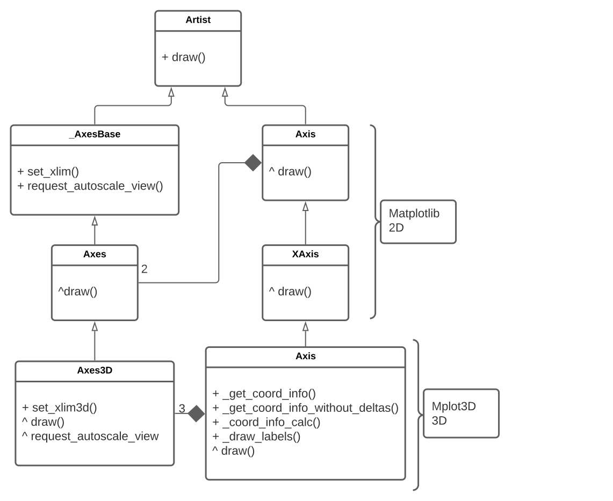
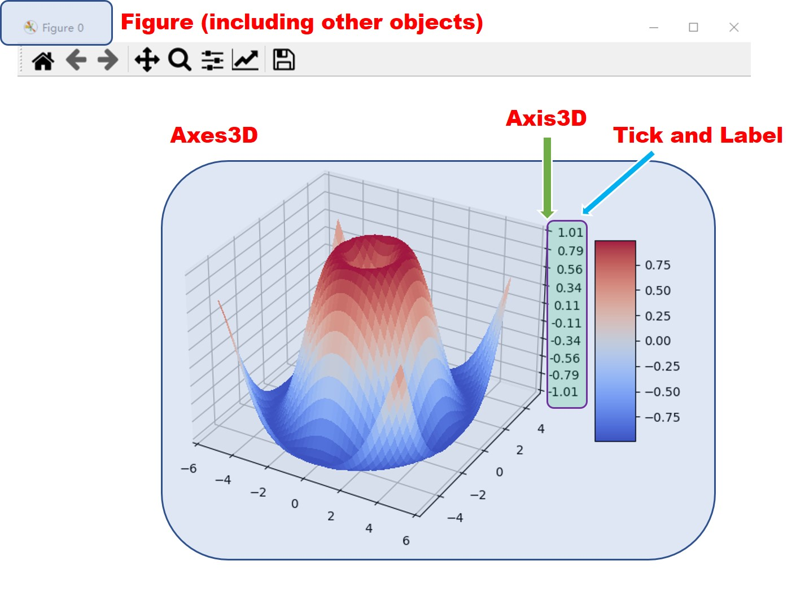
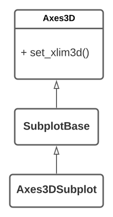

# Report for assignment 4

## Project

Name: `matplotlib`

URL: https://github.com/matplotlib/matplotlib

A Python library that is used to visualize data and create graphs.

## Onboarding experience
We chose the same project as the one in Assignment 3. With the knowledge we learned from that assignment, setting up the development suite was easy this time around.

Similar to Assignment 3 we followed the instructions written in the [install document](INSTALL.rst) which is clear enough to get us running.

## Effort spent

- **Markus**
  - plenary discussions/meetings: 6h
  - reading documentation/code: 6h
  - configuration and setup: 0.5h
  - analyzing code/output: 3h
  - writing documentation: 3h
  - writing code: 3h
  - running tests: 2h
- **Justin**
  - plenary discussions/meetings: 6h
  - reading documentation/code: 6h
  - configuration and setup: 0.5h
  - analyzing code/output: 2h
  - writing documentation: 4h
  - writing code: 2h
  - running tests: 1h
- **David**
  - plenary discussions/meetings: 6h
  - reading documentation/code: 6h
  - configuration and setup: 0.5h
  - analyzing code/output: 4h
  - writing documentation: 3h
  - writing code: 2h
  - running tests: 1h
- **Jiarui**
  - plenary discussions/meetings: 6h
  - reading documentation/code: 7h
  - configuration and setup: 0.5h
  - analyzing code/output: 2h
  - writing documentation: 3h
  - writing code: 2h
  - running tests: 0.5h

## Overview of issue #19296

Title: *Bbox.frozen() does not copy minposx/minposy*

URL: https://github.com/matplotlib/matplotlib/issues/19296

Our PR (**which got approved and merged**): https://github.com/matplotlib/matplotlib/pull/19641

### Description
The class Bbox is a representation of a bounding box and has a method `frozen` which returns a static independent copy of an object that should not be affected by changes to the original object. This method does however not copy the `minpos` attribute of this object which is needed in some cases where the graph is log scaled.

This issue turned out to be pretty easy to solve after some research but we decided to solve it anyways and chose another harder issue as well.

### Scope (functionality and code affected)
Changes were only made in the Bbox class by overriding a parent method. This affects every class containing a `Bbox` which is all axes. However the fix will only be noticed in a few cases where the graph has some log scaling.

### Requirements for the new feature or requirements affected by functionality being refactored

#### [Requirement ID: 1]
**Title:** A log scaled `Axes` should have a manual way of being prevented from auto scaling

**Description:**

In some cases `Axes` objects are autoscaled even if the user did not intend them to be. This can be prevented by manually setting the `dataLim` of the `Axes`. This should work in same way on both log-scaled and lin-scaled `Axes`.

#### [Requirement ID: 2]
**Title:** All data in a bounding box should be copied when calling `frozen()`

**Description:**

The `dataLim` property of an `Axes` can be copied by calling its method `frozen()`. This method should always copy all properties of the `dataLim`.

### Code changes

#### Patch

`git diff 9c98ab0992915cf7c2be030c6b418eeefd0b0f25 7c535fb07d4a64c6ca9440a06a2c62ccba6d09ae`

There are two main changes done by the patches. The first is the introduction of a unit test that replicates the bug that was found as described here: [issue #19296](https://github.com/matplotlib/matplotlib/issues/19296). The issue describes a strange behavior when retrieving the minimum positions of a copy of a bounding box in log scale.

The second change is the fix itself to the problem. We discovered that the inherited function did not get the correct value even though it was set correctly but instead took the initialization value. A fix to this was to introduce an overriding function in the bounding box class to retrieve the correct data and return it.

### Test results
For this small change one test was enough to cover the requirements. Apart from a few tests that are flaky in a macOS environment the test suite runs fine both before and after the change.

- [Before](test-reports/mac-before-test.txt)
  - These are the tests that were failing before we did any changes. They have to do with a macOS specific bug that is addressed among the issues of matplotlib and are flaky.
- [Added failing test](test-reports/mac-with-frozen-test.txt)
  - This is a run of only our added test before we introduced the fix.
- [After](test-reports/mac-after-fix.txt)
  - This is a run of the complete test suite after we added the fix. As can be seen here it's the same flaky tests (one more this time) that fail as in the beginning and our added test runs fine.

### UML class diagram

*Figure1. UML diagram of the affected classes before the changes. The `^ function()` syntax expresses that the class overrides an inherited function*

*Figure2. UML diagram of the affected classes after the changes. The `^ function()` syntax expresses that the class overrides an inherited function*

#### Key changes/classes affected
The refactoring mainly happens in the class `Bbox`. After the changes, the method `frozen()` is added to override the corresponding method in the parent class `BboxBase`, and to copy the `_minpos` property.

## Overview of issue #18052

Title: *the limits of axes are inexact with mplot3d*

URL: https://github.com/matplotlib/matplotlib/issues/18052

We have not created a pull request out of our fix yet due to it introducing a bug that needs a solution before we can PR it. There is an ongoing discussion in the issue thread about this.

### Description
In the 3D case, after the bound of an axis is set manually, for example, by `set_xlim()`, it will still be expanded automatically. The desired behavior is that the axis of the graph should be expanded only if the limits is not set by the user.

### Scope (functionality and code affected)
For this issue the majority of the code changes occurred in the `Axis` class in the mplot3d toolkit. We did modifications and refactoring to the `_get_coord_info` method. This makes it possible to still apply the calculations in the method without adding the delta padding, while still preserving the old function which is still used to correctly render the labels.

We also applied changes and refactored the existing `draw` function in the `Axis` class to two separate draw functions. After our change labels and grid/axis lines are rendered in separate methods rather than in the same. Figure 3 and 4 show UML diagrams of the involved classes before and after our changes.

### Requirements for the new feature or requirements affected by functionality being refactored

#### [Requirement ID: 3]
**Title:** Render exact limits of axes in 3d plot

**Description:**

In a 3D plot, the limits of axis are auto-expanded, even if they are set manually and exactly. Some hard-coded addition to the limits should be removed. Limits fetched from the method `_get_coord_info()` in class `axis3d.Axis` should be exact with the user's settings.

#### [Requirement ID: 4]

**Title:** Draw labels in a proper position

**Description:**

The position of the labels should be coordinated with the axis of the graph. The rendering of the label is affected by the `delta` variable. Modifications to the code should preserve the labels position but fix the graph when autoscaling is turned off.

#### [Requirement ID: 5]

**Title:** Render grid lines under the axis

**Description:**

In a 3d plot, the order of rendering `Artist`s really affects the final visualization. To make the axis visible, if it coincides with one grid line, the grid line should be rendered first to make it under the axis.

### Code changes

#### Patch

`git diff 97258e92da3dd503d9f1772ea5c3130369d483d7 b3ac3d5e15feae09e9358103851bdf9d75b64315`

For this fix, we found that there are two possible ways to solve it. The first would be a change to the `_get_coord_info` logic by removing parts of the calculation involving `mins` and `maxs`. This would produce the correct output when the user specifies a boundary to the 3D graph. The issue with this approach is that it changes the behavior of `_get_coord_info` which could cause unforeseen issues.

The second path, which is what we have decided to go forward with, would be to fix the issue by preserving `_get_coord_info`. We refactored the `draw` function to not handle the labels and instead let `_draw_labels` handle it. We did this as the labels require the existing logic to be properly shown but the other parts of the graph requires the new logic to get the expected outcome. We then also refactored `_get_coord_info` to handle the different cases. This resulted in `_get_coord_info` and `_get_coord_info_without_deltas` being called depending on the situation. These two function would then call `_get_coord_info_calc` which contains the calculations performed in `_get_coord_info` before being refactored. The function `_get_coord_info_calc` handles in creating a 3D space where graph would be drawn on and requires data from the caller to create the correct graph. See Figure 3 and 4 further down for a UML diagram on these changes.

Both of these changes affect other parts of the codebase, mainly in two areas. The first is that they both cause errors to occur on some unit test as they have expected the buggy output. This was however fixed by modifying all failing unit tests with correct expected output data. The second would be in causing weird rendering behavior with the axis or spines of the graph. When rendering the graph the X-axis would be a different color compared to the expected color found in the Y-axis and Z-axis.

We have discussed this last topic regarding the X-axis oddity with the Matplotlib community. The discussion can be found [here](https://github.com/matplotlib/matplotlib/issues/18052).

### Test results
Since the fix for this issue required changes to the API a lot of the tests needed to be corrected after we introduced our fix. However, after that were done, the whole test suite ran fine. To change all the test we had to regenerate all the expected output images for all failing unit tests, inspect them to see that the behavior was correct and add them to the test suite.

- [Before](test-reports/mac-2-before-change.txt)
  - This is a run of the whole test suite before any changes.
- [Added fix](test-reports/mac-2-deltas-removed.txt)
  - This is a run of the whole test suite after our API-breaking fix have been introduced. As can be seen in the report, roughly half of the tests now fail.
- [After](test-reports/mac-2-after-updated-tests.txt)
  - This is a run from after the tests have been corrected.

### UML class diagram

*Figure3. UML diagram of the affected classes before changes. The `^ function()` syntax expresses that the class overrides an inherited function*

*Figure4. UML diagram of the affected classes after the changes. The `^ function()` syntax expresses that the class overrides an inherited function*

#### Key changes/classes affected
The changes are mostly done in the class `axis3d.Axis`. Method `_get_coord_info_without_deltas()` is created based on `_get_coord_info()` to prevent autoscaling. `_coord_info_calc()` is extracted from `_get_coord_info()`. And `draw_labels()` is extracted from `draw()` for drawing labels because variable `deltas` for autoscaling is needed.

## Overall experience

### What are your main take-aways from this project? What did you learn?

Combined with assignment 3, we have gained valuable experience in working with open source projects. Matplotlib was chosen for both assignments and because of this we learned more about how it works under the hood.

One of the most valuable take-aways is learning to read code from other developers in a complex codebase. We learned from reading documentations, finding examples, and reading the source code directly to understand the problems presented in the issues and how certain parts of the software itself works. It also helps when interacting with other developers of the project as they are able to point us in the right direction or recommend certain ways to do things. We also learned how to conform to standards and to follow procedures for our work to be accepted into the project.

### How did you grow as a team, using the Essence standard to evaluate yourself?

We think that we have improved as a team. For example in regards to the Essence standard we think that we have fulfilled "Procedures are in place to handle feedback on the team’s way of working." as we have discussions after receiving such feedback. We would discuss on how to improve our work and how to fulfill the requirements that are left.

With this fulfilled we believe that we are on the Essence standard state of: In Place. From what we have experience we believe that the team is that our team members are using our way of working to accomplish the task at hand.

# Optional points for P+

## [Point 1] Architectural overview 
<!-- The architecture and purpose of the system are presented in an overview of about 1–1.5 pages; consider using a diagram. -->

Matplotlib is a popular plotting library in Python community. It has been used by about 322k users and contributed by 1063 contributors so far. Our work is basically based on its sub-module, `mpl_toolkits.mplot3d`. 

*`mpl_toolkits.mplot3d` provides some basic 3D plotting (scatter, surf, line, mesh) tools. Not the fastest or most feature complete 3D library out there, but it ships with Matplotlib and thus may be a lighter weight solution for some use cases. -- matplotlib documentation*

Some tutorials are given in the documentation but there is still a lack of further explanation about its code architecture. In folder `mplot3d`, there are mainly four scripts, `axes3d.py`, `axis3d.py`, `art3d.py` and `proj3d.py`.

### [ `mplot3d.axes3d` ]
In matplotlib, an `axes` can be roughly regarded as a canvas or a `subplot`.
In 2D cases, users can `import matplotlib.pyplot as plt` and call `plt.axes()` to generate an `Axes` object. In 3D cases, the difference is that users may `from mpl_toolkits.mplot3d import Axes3D`, which is derived from `Axes` class. Generally, users often use some code like 

    fig = plt.figure(1)
    ax = fig.gca(projection='3d')

The first row generates a `figure.Figure` object and the second row creates an `Axes3D` object in this figure, so as to draw something. A `Figure` is two-dimensional but it can show 3D objects. An `Axes3D` contains some 3D components and illustrates their projection. Here is a diagram which shows the relationship between `Figure`, `Axes3D` and other components.

*Figure5. Some key classes in `mplot3d` and `pyplot`*

Some crucial properties and methods related to our work:

* `Axes3D.autoscale()` controls the value of properties `_autoscaleXon`, `_autoscaleYon`, `_autoscaleZon`, which determines the autoscaling process of `Axis3D`: x-, y- and z-axis.
  
* `Axes3D.autoscale_view()`: According to the value of the properties like `_autoscaleXon`, this method will autoscale the corresponding `Axis3D` by calling `set_xbound()`.

* `Axes3D.set_xlim3d()` is the 3D version of `Axes.set_xlim()`. It deals with the bounds given by users and autoscaling cases. `xlim3d` is set as an alias of `xlim` and the following code works. 

      ax.set_xlim(0, 1)

### [ `mplot3d.axis3d` ]
This module includes the classes and their methods about the axis in 3D axes subplot. The class `axis3d.Axis` is derived from the class `axis.XAxis`, and its derived classes for three dimensions are `axis3d.XAxis`, `axis3d.YAxis` and `axis3d.ZAxis`, respectively.

Some key properties and methods of an `axis3d.Axis` object:

* `axes`: The `axes3d.Axes` object to which it belongs.
* `_axinfo`: Some information about appearance will be stored in this property, depending on which dimension the axis is in.
* `_get_coord_info()`: This methods gets bound information from the `axes` property and influences the limit of the axis.
* `draw()` and `draw_pane()`: Given a renderer, the corresponding `Artist` can be drawed by this `Axis` object.

There are also some "getter" and "setter" methods with respect to axis-related artists, that is `Tick` and `Label`s.

### [ `mplot3d.art3d` ]
The module `art3d` mostly copes with 2D objects for 3D visualization. Some classes are `Text3D`, `Line3D` and so on. In addition, relevant `Collection` subclasses are added in this module. Basically, a `Collection` makes it easier for users to add a bunch of `Artist`s which are of the same class into an `Axes` and render them in a similar way. For example, in Figure 5, the surface is a `art3d.Poly3DCollection`, which is composed of multiple polygons.

### [ `mplot3d.proj3d` ]
This part is related to some calculation tasks, and it helps to compute 3D projection. For instance, `_line2d_seg_dist()` computes the distance between a point a line. In a word, it is almost all about math.

## [Point 2] Relation to design pattern(s)

There exist some design patterns in `mplot3d` module. Here are some examples. Our refactoring influences 3D `Axis` and `Axes`, mainly about limits and bounds. This involves a lot of interaction with the properties and methods of the two classes `Axes`, `Axis` and their subclasses.

Name: Factory Pattern

Problem:

As an actual requirement, there should different kinds of `Axes`, which probably makes a lot of subclasses of `Axes`. However, for plotting a single `Figure`, not so many subclasses are needed. For instance, in the following code, it generates an `axes._subplots.Axes3DSubplot` object, which is a derived class of `Axes3D`, as shown in Figure 6.

    from mpl_toolkits.mplot3d import Axes3D
    import matplotlib.pyplot as plt
    fig = plt.figure()
    ax = fig.gca(projection = '3d')
    plt.show()

*Figure6. UML diagram including `Axes3DSubplot`*

Design:

If the code `import matplotlib.axes._subplots.Axes3DSubplot` is run, an error will be raised because this class is missing. The reason is that a function `axes._subplot.subplot_class_factory()` is responsible for creating this subclass. As a class is dynamically generated if necessary, the complexity of architecture decreases. In `_subplot.py`:

    Subplot = subplot_class_factory(Axes)
    # Axes as an argument is a class derived from `Axes`

Name: Bridge Pattern

Problem: 

There are different kinds of "axis" because of different ticks, labels and gridlines, which may cause the amount of axis classes too high.

Design:

In fact, the `Axis` class is like a bridge between different objects, as it contains some reference of this objects. This design pattern effectively controls the number of subclasses.

Name: Wrapper (Decorator) Pattern

Problem: 

There is a strong relationship between `Axes` and `Axis`. Especially in 3D case, there are more `Axis`s in one `Axes`, so the communication between classes is a problem. API could be very verbose and in a great number.

Design: 

A class `_base._axis_method_wrapper` can wrap a method of `Axis` and send it to `Axes` as a method. In this way, a method of a certain `Axis` of an `Axes` is easier to call, and it is easier to refactor the code as this wrapper can produce an interface with only one line of code. An example: In `axis3d`:
    
    get_zticks = _axis_method_wrapper("zaxis", "get_ticklocs")

A user can use the following interface to get a property of an `Axis` object:

    zticks = ax.get_zticks()

It is much more friendly.

## [Point 3] Trace tests to requirements.

**Issue #19296:**

Our new test function `test_bbox_frozen_copies_minpos()` should be traced to requirement: **ID=1** and **ID=2**. A passed test will ensure these requirements are fulfilled.

Document: This test function tests if `minpos` property is copied in method `Bbox::frozen()`, which overrides the corresponding method in the parent class. If it passes, the requirements above should have been implemented.

**Issue #18052:**

The requirements **ID=3** and **ID=4** should be considered together. We have updated some stale test cases for that. In total, 44 tests in folder: `mpl_toolkits/mplot3d/tests/test_mplot3d.py` are updated. These tests compare the result image with some existing images by using a decorator `@mpl3d_image_comparison`. If the deviation can be tolerated, the test passes.

Here are some examples from 44 test functions.

`test_add_collection3d_zs_array` and `test_add_collection3d_zs_scalar`:

A `Collection` of lines are plotted into an `Axis3D`. The test function calls `set_xlim()`, `set_ylim()` and `set_zlim()`. The limits of axes should be exact with the set value, and the position of labels should be in place. (requirement ID=3, 4)

`test_axes3d_cla`:

Nothing is plotted in the axes and all `Axis` is switched off. In this case, the labels should still be in place and the limit of each axis should be [0, 1], as the default value. (ID=3, 4)

`test_axes3d_isometric`:

Some test cases like this one do not change too much. But as we removed the variable `deltas` in the code for autoscaling, the scale of each axis should shrink a little. Except this point, it remains the same. (ID=3)

`test_axes3d_labelpad`:

What's more, this function adds text labels, which should also be in place. And the limit of each axis is [0, 1] as well. (ID=3, 4)

`test_axes3d_rotated` and `axes3d_ortho.png`:

The refactoring should be robust to the direction of projection. Different angles of view are considered. (ID=3, 4)

`test_bar3d`, `test_bar3d_shaded` and `test_bar3d_notshaded`:

Different types of 3D bars are plotted in `Axes`. No labels. (ID=3)

`test_contour3d`, `test_contourf3d` and `test_contourf3d_fill`:

Plot contour figures with `contour()` method. No labels are given, but the limit of axis should be exact with the gridline. (ID=3)

`test_mixedsubplot`:

In this figure, there should be two `Axes` objects. The 2D axes should be autoscaled but the 3D axes should not. (ID=3)

`test_minor_ticks`:

Some minor ticks are added to all three `Axis` object. In this case, minor labels should behave properly as well. (ID=3, 4)

Some other tests are about "quiver", "scatter", "stem", "text", "surface" and so on. All of these tests can be traced to at least either of requirements ID=3 and 4.

## [Point 4] The patch is clean.

Yes, our patches are clean.

## [Point 5] Considered for acceptance (passes all automated checks).
For issue #19296, all automated checks on Github except those about documentation have passed. And our patch has been merged to the original project in this pull request: https://github.com/matplotlib/matplotlib/pull/19641 .

## [Point 6] How would you put your work in context with best software engineering practice? 
*"You can argue critically about the benefits, drawbacks, and limitations of your work carried out, in the context of current software engineering practice, such as the SEMAT kernel (covering alphas other than Team/Way of Working)."*

Reference to Essence: 
    
    http://semat.org/quick-reference-guide

Besides `6.Team` and `7.Way-of-Working`, there are 5 alphas in SEMAT kernel: `1.Stakeholders`, `2.Opportunity`, `3.Requirements`, `4.Software System`, `5.Work`.

This assignment is the last one in this course and we have really learned a lot, as we selected a really popular and complicated project, `Matplotlib`.

In this way, our stakeholders are the develope group of `Matplotlib` and a lot of other contributors. In addition to the meeting in our team, we also discuss with several stakeholders on Github issue pages. They provided many recommendations and we discuss about our analysis of the source code. Finally, one of our patches is accepted and merged into the master branch, of which we are proud.

Obviously, the `Stakeholder` groups are identified and their responsibilities are clearly defined (as reviewers). Thus, the `Recognized` part of the essence is satisfied. We also feel that the stakeholders involve actively, because they assist our team gladly and response in good time. So the `Involved` alpha state is also great, which are benefits. The limitation is that we cannot get feedback from users now and we cannot easily check if the system fulfills our expectation because it is an open-source project rather than a product for business use.

As far as `Opportunities`, this library is widely used and some users open issues because some bugs bring inconvenience to their use. We find two issues that are confirmed to be bugs, which means the `Identified` state of `Opportunities` is positive. Some programmers have discussed the issues and have proposed some ideas, consequently the `Solution Needed` state is also optimistic, which also belongs to our benefits. However, the drawback is that the `Viable` and `Addressed` states of one issue had not been fulfilled before we began to engage in it, which finally makes it a partially-solved issue. A lesson is that solving a difficult issue in limited time may not be feasible. Actually, it is a old library which leaves some unreasonable code.

The `Requirements` that we proposed are not discussed with stakeholders, which is a drawback. But by reading the issue, the requirements should be `Conceived` and `Bounded`. We think our description of requirements should be `Acceptable`, and one issue we solved can fulfill `Fulfilled` state. However, our solution to another issue is not good enough because we only solve a part of the requirements but also cause other effects.

`Software System` alpha is a limitation of our work because we only refactor some code and run tests, neglecting its usage in a system.

In terms of `Work` alpha, we `Intiated`, `Prepared` and `Started` successfully, and we make it `Under Control`. But we have not `Conclude` or `Closed` our work because the the requirements are not fully fulfilled and there is still further discussion on Github. However, we can conclude the lessons we learned and give a self-evaluation of our work.

Finally, the most important thing is that through this work, we are familiar with the software development process and gain experience.
