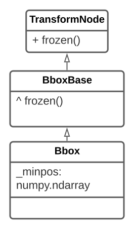
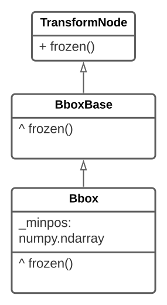
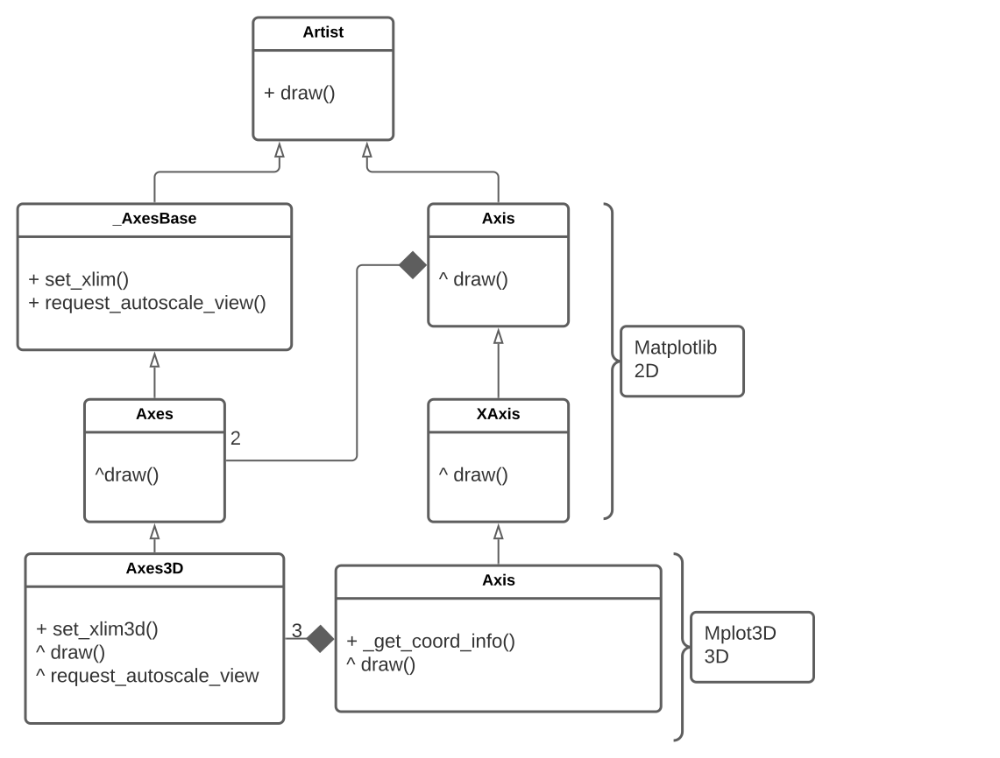

# Report for assignment 4

## Project

Name: `matplotlib`

URL: https://github.com/matplotlib/matplotlib

A Python library that is used to visualize data and create graphs.

## Onboarding experience
We chose the same project as the one in Assignment 3. With the knowledge we learned from that assignment, setting up the development suite was easy this time around.

Similar to Assignment 3 we followed the instructions written in the [install document](INSTALL.rst) which is clear enough to get us running.

## Effort spent
<!-- For each team member, how much time was spent in

1. plenary discussions/meetings;

2. discussions within parts of the group;

3. reading documentation;

4. configuration and setup;

5. analyzing code/output;

6. writing documentation;

7. writing code;

8. running code?

For setting up tools and libraries (step 4), enumerate all dependencies
you took care of and where you spent your time, if that time exceeds
30 minutes. -->

- **Markus**
  - plenary discussions/meetings: 6h
  - reading documentation/code: 6h
  - configuration and setup: 0.5h
  - analyzing code/output: 3h
  - writing documentation: 3h
  - writing code: 3h
  - running tests: 2h
- **Justin**
  - plenary discussions/meetings: 6h
  - reading documentation/code: 6h
  - configuration and setup: 0.5h
  - analyzing code/output: 2h
  - writing documentation: 4h
  - writing code: 2h
  - running tests: 1h
- **David**
  - plenary discussions/meetings: 6h
  - reading documentation/code: 6h
  - configuration and setup: 0.5h
  - analyzing code/output: 4h
  - writing documentation: 3h
  - writing code: 2h
  - running tests: 1h
- **Jiarui**
  - plenary discussions/meetings: 6h
  - reading documentation/code: 7h
  - configuration and setup: 0.5h
  - analyzing code/output: 2h
  - writing documentation: 3h
  - writing code: 2h
  - running tests: 0.5h

## Overview of issue #19296

Title: *Bbox.frozen() does not copy minposx/minposy*

URL: https://github.com/matplotlib/matplotlib/issues/19296

Our PR (**which got approved and merged**): https://github.com/matplotlib/matplotlib/pull/19641

### Description
The class Bbox is a representation of a bounding box and has a method `frozen` which returns a static independent copy of an object that should not be affected by changes to the original object. This method does however not copy the `minpos` attribute of this object which is needed in some cases where the graph is log scaled.

This issue turned out to be pretty easy to solve after some research but we decided to solve it anyways and chose another harder issue as well.

### Scope (functionality and code affected)
Changes were only made in the Bbox class by overriding a parent method. This affects every class containing a `Bbox` which is all axes. However the fix will only be noticed in a few cases where the graph has some log scaling.

### Requirements for the new feature or requirements affected by functionality being refactored
<!-- Requirements related to the functionality are identified and described in a systematic way. Each requirement has a name (ID), title, and description. The description can be one paragraph per requirement. -->

#### [Requirement ID: 1]
**Title:** A log scaled `Axes` should have a manual way of being prevented from auto scaling

**Description:**

In some cases `Axes` objects are autoscaled even if the user did not intend them to be. This can be prevented by manually setting the `dataLim` of the `Axes`. This should work in same way on both log-scaled and lin-scaled `Axes`.

<!-- In some functions, some `Artist` objects are autoscaled for some unnecessary reasons, especially because of hard coding. Some subclasses of `Artist` are `Axis`, `Axes` and so on. There should be a proper way to control the data limit of `Artist` object. -->

#### [Requirement ID: 2]
**Title:** All data in a bounding box should be copied when calling `frozen()`

**Description:**

The `dataLim` property of an `Axes` can be copied by calling its method `frozen()`. This method should always copy all properties of the `dataLim`.

<!-- The `frozen()` method of the class `Bbox` is inherited from its parent class `BboxBase`, which however does not copy the variable `minpos` in `Bbox`. As storing `minpos` is mandatory for storing a log scale, the method `frozen()` should be overrided in `Bbox` to copy it. -->

<!-- *Optional (point 3): trace tests to requirements.*

Test function `test_bbox_frozen_copies_minpos()` should be traced to requirement: **ID=2**. -->

### Code changes

#### Patch

`git diff 9c98ab0992915cf7c2be030c6b418eeefd0b0f25 7c535fb07d4a64c6ca9440a06a2c62ccba6d09ae`

There are two main changes done by the patches. The first is the introduction of a unit test that replicates the bug that was found as described here: [issue #19296](https://github.com/matplotlib/matplotlib/issues/19296). The issue describes a strange behavior when retrieving the minimum positions of a copy of a bounding box in log scale.

The second change is the fix itself to the problem. We discovered that the inherited function did not get the correct value even though it was set correctly but instead took the initialization value. A fix to this was to introduce an overriding function in the bounding box class to retrieve the correct data and return it.

<!-- *Optional (point 4): the patch is clean.*

Yes, it is.

*Optional (point 5): considered for acceptance (passes all automated checks).*

All automated checks except those about doc have passed. This patch has been merged to the original project in this pull request:

https://github.com/matplotlib/matplotlib/pull/19641 -->

### Test results
For this small change one test was enough to cover the requirements. Apart from a few tests that are flaky in a macOS environment the test suite runs fine both before and after the change.

- [Before](test-reports/mac-before-test.txt)
  - These are the tests that were failing before we did any changes. They have to do with a macOS specific bug that is addressed among the issues of matplotlib and are flaky.
- [Added failing test](test-reports/mac-with-frozen-test.txt)
  - This is a run of only our added test before we introduced the fix.
- [After](test-reports/mac-after-fix.txt)
  - This is a run of the complete test suite after we added the fix. As can be seen here it's the same flaky tests (one more this time) that fail as in the beginning and our added test runs fine.

### UML class diagram

*Figure1. UML diagram of the affected classes before the changes. The `^ function()` syntax expresses that the class overrides an inherited function*

*Figure2. UML diagram of the affected classes after the changes. The `^ function()` syntax expresses that the class overrides an inherited function*

#### Key changes/classes affected
The refactoring mainly happens in the class `Bbox`. After the changes, the method `frozen()` is added to override the corresponding method in the parent class `BboxBase`, and to copy the `_minpos` property.

<!-- *Optional (point 1): Architectural overview.*
*Optional (point 2): relation to design pattern(s).* -->

## Overview of issue #18052

Title: *the limits of axes are inexact with mplot3d*

URL: https://github.com/matplotlib/matplotlib/issues/18052

We have not created a pull request out of our fix yet due to it introducing a bug that needs a solution before we can PR it. There is an ongoing discussion in the issue thread about this.

### Description
In the 3D case, after the bound of an axis is set manually, for example, by `set_xlim()`, it will still be expanded automatically. The desired behavior is that the axis of the graph should be expanded only if the limits is not set by the user.

### Scope (functionality and code affected)
For this issue the majority of the code changes occurred in the `Axis` class in the mplot3d toolkit. We did modifications and refactoring to the `_get_coord_info` method. This makes it possible to still apply the calculations in the method without adding the delta padding, while still preserving the old function which is still used to correctly render the labels.

We also applied changes and refactored the existing `draw` function in the `Axis` class to two separate draw functions. After our change labels and grid/axis lines are rendered in separate methods rather than in the same. Figure 3 and 4 show UML diagrams of the involved classes before and after our changes.

### Requirements for the new feature or requirements affected by functionality being refactored

<!-- *"Historically, axis3d has suffered from having hard-coded constants that precluded user adjustments." -- Matplotlib document*

Thus, some hard-coded method in axis3d.py need to be refactored, and those make some requirements. We can modify some render process in these method to get proper visualization. -->

#### [Requirement ID: 3]
**Title:** Render exact limits of axes in 3d plot

**Description:**

In a 3D plot, the limits of axis are auto-expanded, even if they are set manually and exactly. Some hard-coded addition to the limits should be removed. Limits fetched from the method `_get_coord_info()` in class `axis3d.Axis` should be exact with the user's settings.

#### [Requirement ID: 4]

**Title:** Draw labels in a proper position

**Description:**

The position of the labels should be coordinated with the axis of the graph. The rendering of the label is affected by the `delta` variable. Modifications to the code should preserve the labels position but fix the graph when autoscaling is turned off.

#### [Requirement ID: 5]

**Title:** Render grid lines under the axis

**Description:**

In a 3d plot, the order of rendering `Artist`s really affects the final visualization. To make the axis visible, if it coincides with one grid line, the grid line should be rendered first to make it under the axis.

<!-- *Optional (point 3): trace tests to requirements.* -->

### Code changes

#### Patch

`git diff 97258e92da3dd503d9f1772ea5c3130369d483d7 b3ac3d5e15feae09e9358103851bdf9d75b64315`

For this fix, we found that there are two possible ways to solve it. The first would be a change to the `_get_coord_info` logic by removing parts of the calculation involving `mins` and `maxs`. This would produce the correct output when the user specifies a boundary to the 3D graph. The issue with this approach is that it changes the behavior of `_get_coord_info` which could cause unforeseen issues.

The second path, which is what we have decided to go forward with, would be to fix the issue by preserving `_get_coord_info`. We refactored the `draw` function to not handle the labels and instead let `_draw_labels` handle it. We did this as the labels require the existing logic to be properly shown but the other parts of the graph requires the new logic to get the expected outcome. We then also refactored `_get_coord_info` to handle the different cases. This resulted in `_get_coord_info` and `_get_coord_info_without_deltas` being called depending on the situation. These two function would then call `_get_coord_info_calc` which used to be in `_get_coord_info` before being refactored. The function `_get_coord_info_calc` handles in creating a 3D space where graph would be drawn on and requires data from the caller to create the correct graph. See Figure 3 and 4 further down for a UML diagram on these changes.

Both of these changes affect other parts of the codebase, mainly in two areas. The first is that they both cause errors to occur on some unit test as they have expected the buggy output. This was however fixed by modifying all failing unit tests with correct expected output data. The second would be in causing weird rendering behavior with the axis or spines of the graph. When rendering the graph the X-axis would be a different color compared to the expected color found in the Y-axis and Z-axis.

We have discussed this last topic regarding the X-axis oddity with the Matplotlib community. The discussion can be found [here](https://github.com/matplotlib/matplotlib/issues/18052).

<!-- *Optional (point 4): the patch is clean.*
Yes, it is. -->

<!-- *Optional (point 5): considered for acceptance (passes all automated checks).* -->

### Test results
Since the fix for this issue required changes to the API a lot of the tests needed to be corrected after we introduced our fix. However, after that were done, the whole test suite ran fine. To change all the test we had to regenerate all the expected output images for all failing unit tests, inspect them to see that the behavior was correct and add them to the test suite.

- [Before](test-reports/mac-2-before-change.txt)
  - This is a run of the whole test suite before any changes.
- [Added fix](test-reports/mac-2-deltas-removed.txt)
  - This is a run of the whole test suite after our API-breaking fix have been introduced. As can be seen in the report, roughly half of the tests now fail.
- [After](test-reports/mac-2-after-updated-tests.txt)
  - This is a run from after the tests have been corrected.

### UML class diagram

*Figure3. UML diagram of the affected classes before changes. The `^ function()` syntax expresses that the class overrides an inherited function*

*Figure4. UML diagram of the affected classes after the changes. The `^ function()` syntax expresses that the class overrides an inherited function*

#### Key changes/classes affected
The changes are mostly done in the class `axis3d.Axis`. Method `_get_coord_info_without_deltas()` is created based on `_get_coord_info()` to prevent autoscaling. `_coord_info_calc()` is extracted from `_get_coord_info()`. And `draw_labels()` is extracted from `draw()` for drawing labels because variable `deltas` for autoscaling is needed.

<!-- TODO:
*Optional (point 1): Architectural overview.*
*Optional (point 2): relation to design pattern(s).*
-->

## Overall experience

### What are your main take-aways from this project? What did you learn?

Combined with assignment 3, we have gained valuable experience in working with open source projects. Matplotlib was chosen for both assignments and because of this we learned more about how it works under the hood.

One of the most valuable take-aways is learning to read code from other developers in a complex codebase. We learned from reading documentations, finding examples, and reading the source code directly to understand the problems presented in the issues and how certain parts of the software itself works. It also helps when interacting with other developers of the project as they are able to point us in the right direction or recommend certain ways to do things. We also learned how to conform to standards and to follow procedures for our work to be accepted into the project.

### How did you grow as a team, using the Essence standard to evaluate yourself?

We think that we have improved as a team. For example in regards to the Essence standard we think that we have fulfilled "Procedures are in place to handle feedback on the team’s way of working." as we have discussions after receiving such feedback. We would discuss on how to improve our work and how to fulfill the requirements that are left.

With this fulfilled we believe that we are on the Essence standard state of: In Place. From what we have experience we believe that the team is that our team members are using our way of working to accomplish the task at hand.

<!-- *Optional (point 6): How would you put your work in context with best software engineering practice?*

*Optional (point 7): Is there something special you want to mention here?* -->

<!-- ### Checklist (P: 8/8)
- [x] Onboarding experience
- [x] Time spent
- [x] Non-trivial issue
- [x] Requirements
- [x] Patch showed and documented
- [x] Automated test with log
- [x] UML diagram
- [x] Overall experience

### Checklist (P+: ≥4/7)
- [ ] System overview
- [ ] Design patterns
- [ ] Tests traced to requirements
- [x] Clean patch
- [x] Accepted patch
- [ ] Critical argument
- [ ] Something extraordinary -->
